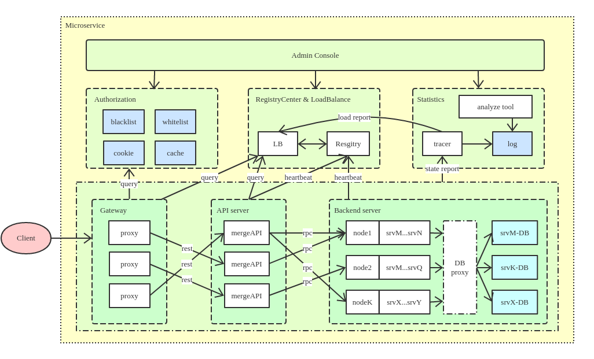

# goDist

goDist is a kind of microservice development tool implemented by Go (is under development).

- gateway 

the services exposed to clients.

- api

the services exposed to gateway services, to pass or merge requests to backend services.

- server

the backend services, kernel logic handlers.

- registry

a kind of service for service discovery.

- loadbalance

not yet openup.

- stat

a kind of distributed service to trace rpc-call chain (using opentracing and jaeger)

*To impletement an architecture like this:*

